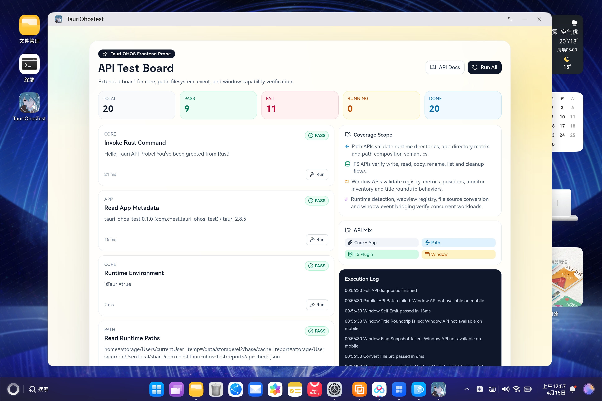

# Tauri prototype for OpenHarmony/HarmonyNext



## Setup

1. Install tauri-cli and ohrs from git.

```bash
cargo install tauri-cli --git https://github.com/tauri-apps/tauri --branch feat/open-harmony

cargo install ohrs
```

2. Clone the repo

```bash
git clone https://github.com/islatri/tauri-ohos-test.git
```

3. Install the dependencies.

```bash
npm i

cd src-tauri && cargo fetch
```

## Build and run

Build with tauri-cli.

```bash
cd src-tauri && cargo tauri ohos build
```


## Note

 1. `libentry.so` is a template library and you can ignore it.
 2. `RustAbility` will forward lifecycle automatically.
 3. The frontend API test board currently covers runtime(core), app, path, filesystem, event, webview, and window/monitor APIs.
